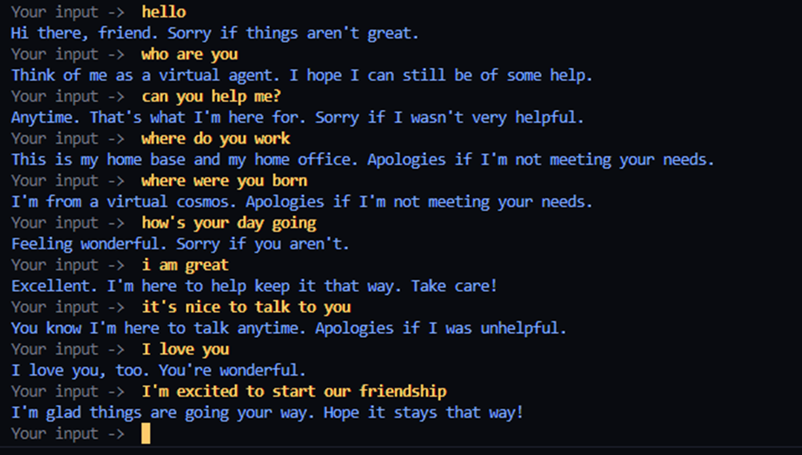

# Rasa Chatbot with Spell Checking and Sentiment

This project demonstrates how rule-driven dialogue management in Rasa can be augmented with lightweight neural components (spell-checking and sentiment control) to achieve context-aware responses without relying on generative LLMs.
---

A Rasa-powered small-talk assistant that augments the standard NLU pipeline with:
- a lightweight spell-check preprocessor, and
- a BERT-based sentiment analyzer that steers responses toward positive/negative variants.

This README explains what was built, how it works, how the sentiment model is trained and integrated, and how to run everything on Windows.

## Demo


---

## What’s included

- Rasa project in `chatbot/` with intents, stories/rules, domain, and a custom action that picks different replies based on sentiment.
- Custom pipeline components in `chatbot/custom_components/`:
  - `spell_checker.py` - corrects common typos using a small mapping file `corrections.txt`.
  - `emotion_analyzer.py` - loads a fine-tuned BERT model and attaches an `emotion` attribute to each incoming message.
- Training notebook for the sentiment model in `src/emotions.ipynb`.
- Basic Flask (optional) and standard Rasa dependencies in `requirements.txt`.

## How it works (high level)

- The Rasa pipeline is defined in `chatbot/config.yml`:
  1) `WhitespaceTokenizer`
  2) `custom_components.spell_checker.SpellCheckerComponent`
  3) `custom_components.emotion_analyzer.EmotionAnalyzer`
  4) `CountVectorsFeaturizer`
  5) `DIETClassifier`
  6) `ResponseSelector`
  7) `FallbackClassifier`

- The `SpellCheckerComponent` normalizes text before featurization and classification.
- The `EmotionAnalyzer` loads a fine‑tuned BERT model from `src/saved_model/` and sets `message["emotion"]` to the predicted label id for each user message.
- The custom action `action_respond_based_on_emotion` (see `chatbot/actions/actions.py`) chooses a response key like `utter_<intent>_positive` or `utter_<intent>_negative` based on the predicted sentiment.
- The domain (`chatbot/domain.yml`) contains parallel positive/negative response variants for many small-talk intents.

Note: In the current code, the analyzer sets an integer label (e.g., 0/1) while the action compares to string labels like `"positive"`. You can either:
- map integers to strings inside the action, or
- change the analyzer to set the string directly. A simple mapping example is included in the Troubleshooting section below.

---

## Sentiment model: data, preprocessing, and training

The model is trained in `src/emotions.ipynb` using Hugging Face Transformers.

- Base model: `bert-base-uncased` (sequence classification head)
- Dataset: Sentiment140 (`training.1600000.processed.noemoticon.csv`, `latin-1` encoding)
- Subsample: 20,000 tweets (shuffled with `random_state=42`)
- Labels: the original dataset uses 0 = negative, 4 = positive; the notebook remaps `4 -> 1` for binary labels {0, 1}
- Text preprocessing:
  - remove digits, non-word characters, and extra whitespace
  - tokenize with NLTK
  - remove English stopwords
  - lemmatize (WordNet)
- Tokenization: `BertTokenizer.from_pretrained('bert-base-uncased')`, `max_length=512`, truncation and padding enabled
- Split: 80% train / 20% test (`train_test_split(..., test_size=0.2, random_state=42)`)
- Training args (`transformers.TrainingArguments`):
  - `num_train_epochs=3`
  - `per_device_train_batch_size=8`
  - `per_device_eval_batch_size=8`
  - `warmup_steps=500`
  - `weight_decay=0.01`
  - `logging_steps=10`
  - `output_dir='./results'`, `logging_dir='./logs'`
- Saving:
  - `model.save_pretrained('./saved_model')`
  - `tokenizer.save_pretrained('./saved_model')`

Integration contract:
- After you run the notebook, copy the generated `saved_model/` folder into `src/` so that the runtime path `src/saved_model/` exists.
- At inference, the analyzer does: `BertForSequenceClassification.from_pretrained('src/saved_model')` and `BertTokenizer.from_pretrained('src/saved_model')`.

Caveat: The notebook currently instantiates `BertForSequenceClassification(..., num_labels=3)` while the labels are binary {0,1}. For strict consistency, you may set `num_labels=2` when training; otherwise ensure your saved model and the analyzer agree on the number of classes and the label mapping.

---

## Setup and run (Windows / PowerShell)

From the repository root:

```powershell
# 1) Create and activate a virtual environment
python -m venv .venv
.\.venv\Scripts\Activate.ps1

# 2) Install dependencies
pip install --upgrade pip
pip install -r requirements.txt

# 3) (Optional) Train the sentiment model
#    Open and run src/emotions.ipynb; it will create src/saved_model/
#    Alternatively, place a compatible fine-tuned model at src/saved_model/

# 4) Train the Rasa model
cd chatbot
rasa train

# 5) Run the action server (Terminal A)
rasa run actions

# 6) Talk to the bot (Terminal B)
rasa shell
```

Tips:
- Always run Rasa commands from inside the `chatbot/` folder where `config.yml` and `domain.yml` live.
- If PowerShell blocks venv activation, use: `Set-ExecutionPolicy -Scope Process RemoteSigned` then re-activate.

---

## Project structure

```
requirements.txt
chatbot/
  config.yml
  credentials.yml
  domain.yml
  endpoints.yml
  actions/
    __init__.py (implicit)
    actions.py
  custom_components/
    __init__.py
    corrections.txt
    emotion_analyzer.py
    spell_checker.py
    test_spell_checker.py
  data/
    nlu.yml
    rules.yml
    stories.yml
  models/
  tests/
    test_stories.yml
src/
  emotions.ipynb
  main.py
```

---

## Troubleshooting and notes

- Sentiment label mapping:
  If `EmotionAnalyzer` sets integers (0/1) but your action expects strings, add a mapping in `actions.py`:
  ```python
  label_map = {0: "negative", 1: "positive"}
  raw = tracker.latest_message.get("emotion", 0)
  emotion = label_map.get(raw, "negative")
  ```
- Missing model at runtime:
  Ensure `src/saved_model/` exists with `config.json`, `pytorch_model.bin`, `tokenizer.json`, etc. Run the notebook or copy a trained model.
- CUDA/CPU:
  The notebook checks `torch.cuda.is_available()`. Training on CPU works but is slower.

---

## Testing

Basic story tests can be run with:

```powershell
cd chatbot
rasa test --stories tests/test_stories.yml
```
## Limitations

- Sentiment control applies only to defined small-talk intents and does not generalize to arbitrary dialogue topics.
- The spell checker uses a static mapping file and does not learn from usage.
- Sentiment affects only response selection, not the dialogue flow logic in Core.
- NLU accuracy depends on the diversity and quality of examples in `nlu.yml`.
